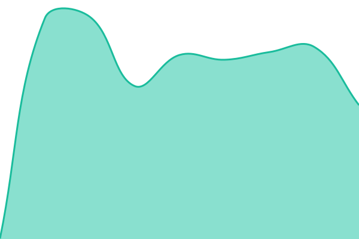
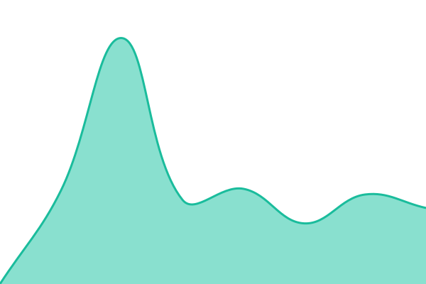
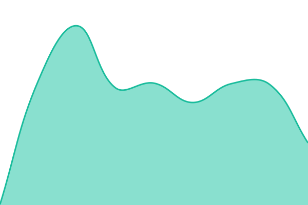
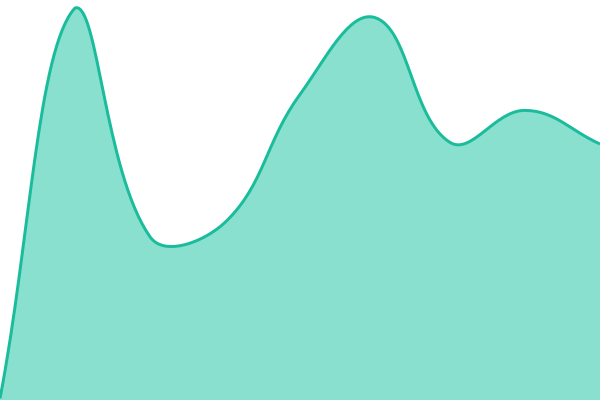
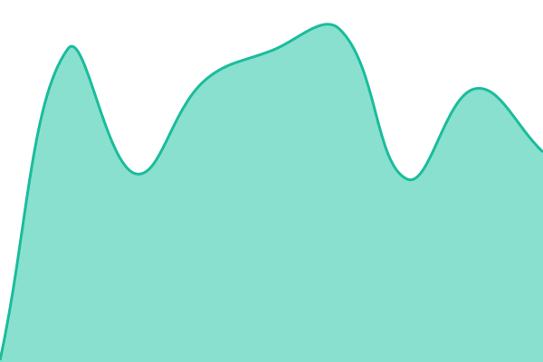
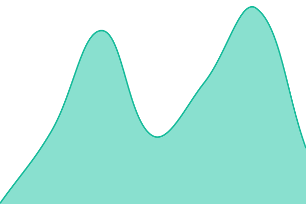
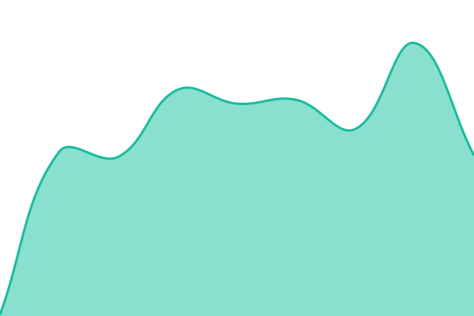
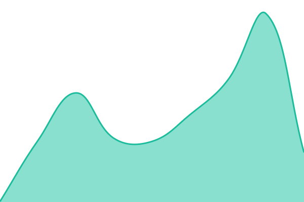
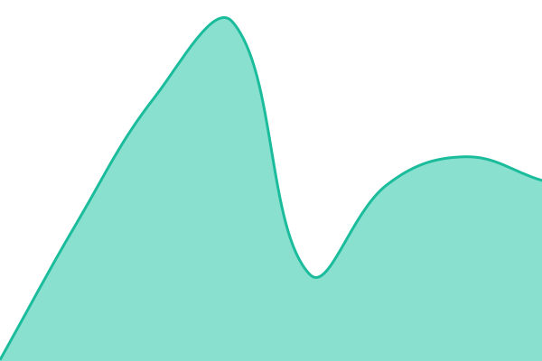

# [📈 Live Status](https://bingosabah.github.io/uptime): <!--live status--> **🟩 All systems operational**

This repository contains the open-source uptime monitor and status page for [bingosabah](https://bingosabah.github.io/uptime), powered by [Upptime](https://github.com/upptime/upptime).

With [Upptime](https://upptime.js.org), you can get your own unlimited and free uptime monitor and status page, powered entirely by a GitHub repository. We use [Issues](https://github.com/bingosabah/uptime/issues) as incident reports, [Actions](https://github.com/bingosabah/uptime/actions) as uptime monitors, and [Pages](https://bingosabah.github.io/uptime) for the status page.

<!--start: status pages-->
<!-- This summary is generated by Upptime (https://github.com/upptime/upptime) -->
<!-- Do not edit this manually, your changes will be overwritten -->
<!-- prettier-ignore -->
| URL | Status | History | Response Time | Uptime |
| --- | ------ | ------- | ------------- | ------ |
|  [Invest Sabah](https://www.investsabah.gov.my) | 🟩 Up | [invest-sabah.yml](https://github.com/bingosabah/uptime/commits/HEAD/history/invest-sabah.yml) | 

 378ms
     
 | 

<a href="https://bingosabah.github.io/uptime/history/invest-sabah">100.00%</a>
    

|  [Invest Sabah (bare domain redirect)](https://investsabah.gov.my) | 🟩 Up | [invest-sabah-bare-domain-redirect.yml](https://github.com/bingosabah/uptime/commits/HEAD/history/invest-sabah-bare-domain-redirect.yml) | 

 1150ms
     
 | 

<a href="https://bingosabah.github.io/uptime/history/invest-sabah-bare-domain-redirect">100.00%</a>
    

|  [Platinum Dental](https://platinumdental.com.my) | 🟩 Up | [platinum-dental.yml](https://github.com/bingosabah/uptime/commits/HEAD/history/platinum-dental.yml) | 

 133ms
     
 | 

<a href="https://bingosabah.github.io/uptime/history/platinum-dental">100.00%</a>
    

|  [FTS Chin Dental](https://ftsdental.com) | 🟩 Up | [fts-chin-dental.yml](https://github.com/bingosabah/uptime/commits/HEAD/history/fts-chin-dental.yml) | 

 115ms
     
 | 

<a href="https://bingosabah.github.io/uptime/history/fts-chin-dental">100.00%</a>
    

|  [KKIMD (DBKK)](https://kkimd.com.my) | 🟩 Up | [kkimd-dbkk.yml](https://github.com/bingosabah/uptime/commits/HEAD/history/kkimd-dbkk.yml) | 

 166ms
     
 | 

<a href="https://bingosabah.github.io/uptime/history/kkimd-dbkk">100.00%</a>
    

|  [ZEAL](https://zealserviceindustry.com) | 🟩 Up | [zeal.yml](https://github.com/bingosabah/uptime/commits/HEAD/history/zeal.yml) | 

 212ms
     
 | 

<a href="https://bingosabah.github.io/uptime/history/zeal">100.00%</a>
    

|  [EasySolar](https://www.easysolar.com.my) | 🟩 Up | [easy-solar.yml](https://github.com/bingosabah/uptime/commits/HEAD/history/easy-solar.yml) | 

 381ms
     
 | 

<a href="https://bingosabah.github.io/uptime/history/easy-solar">100.00%</a>
    

|  [Jesselton Point](https://jesseltonpoint.com.my) | 🟩 Up | [jesselton-point.yml](https://github.com/bingosabah/uptime/commits/HEAD/history/jesselton-point.yml) | 

 143ms
     
 | 

<a href="https://bingosabah.github.io/uptime/history/jesselton-point">100.00%</a>
    

|  [Procraft](https://procraft.com.my) | 🟩 Up | [procraft.yml](https://github.com/bingosabah/uptime/commits/HEAD/history/procraft.yml) | 

 115ms
     
 | 

<a href="https://bingosabah.github.io/uptime/history/procraft">100.00%</a>
    

|  [The BIG G](https://thebigg.com.my) | 🟩 Up | [the-big-g.yml](https://github.com/bingosabah/uptime/commits/HEAD/history/the-big-g.yml) | 

 164ms
     
 | 

<a href="https://bingosabah.github.io/uptime/history/the-big-g">100.00%</a>
    

|  [OGSE](https://ogse-sabah.pages.dev) | 🟩 Up | [ogse.yml](https://github.com/bingosabah/uptime/commits/HEAD/history/ogse.yml) | 

 106ms
     
 | 

<a href="https://bingosabah.github.io/uptime/history/ogse">100.00%</a>
    

|  [Bingo Web Design](https://bingowebdesign.my) | 🟩 Up | [bingo-web-design.yml](https://github.com/bingosabah/uptime/commits/HEAD/history/bingo-web-design.yml) | 

 170ms
     
 | 

<a href="https://bingosabah.github.io/uptime/history/bingo-web-design">100.00%</a>
    

|  [Bingo Progress boards](https://bingo-progress.pages.dev) | 🟩 Up | [bingo-progress-boards.yml](https://github.com/bingosabah/uptime/commits/HEAD/history/bingo-progress-boards.yml) | 

 72ms
     
 | 

<a href="https://bingosabah.github.io/uptime/history/bingo-progress-boards">100.00%</a>
    

|  [HelloReply](https://helloreply.my) | 🟩 Up | [hello-reply.yml](https://github.com/bingosabah/uptime/commits/HEAD/history/hello-reply.yml) | 

 132ms
     
 | 

<a href="https://bingosabah.github.io/uptime/history/hello-reply">100.00%</a>
    

|  [SabahGuide](https://sabahguide.com) | 🟩 Up | [sabah-guide.yml](https://github.com/bingosabah/uptime/commits/HEAD/history/sabah-guide.yml) | 

 156ms
     
 | 

<a href="https://bingosabah.github.io/uptime/history/sabah-guide">100.00%</a>
    

|  [Bagasi](https://bagasi.my) | 🟩 Up | [bagasi.yml](https://github.com/bingosabah/uptime/commits/HEAD/history/bagasi.yml) | 

 122ms
     
 | 

<a href="https://bingosabah.github.io/uptime/history/bagasi">100.00%</a>
    

|  [GoReview](https://goreview.my) | 🟩 Up | [go-review.yml](https://github.com/bingosabah/uptime/commits/HEAD/history/go-review.yml) | 

 158ms
     
 | 

<a href="https://bingosabah.github.io/uptime/history/go-review">100.00%</a>
    

|  [danielwong.me](https://danielwong.me) | 🟩 Up | [danielwong-me.yml](https://github.com/bingosabah/uptime/commits/HEAD/history/danielwong-me.yml) | 

 140ms
     
 | 

<a href="https://bingosabah.github.io/uptime/history/danielwong-me">100.00%</a>
    

<!--end: status pages-->

[**Visit our status website →**](https://bingosabah.github.io/uptime)

## 📄 License

- Powered by: [Upptime](https://github.com/upptime/upptime)
- Code: [MIT](./LICENSE) © [Anand Chowdhary](https://anandchowdhary.com)
- Data in the `./history` directory: [Open Database License](https://opendatacommons.org/licenses/odbl/1-0/)
